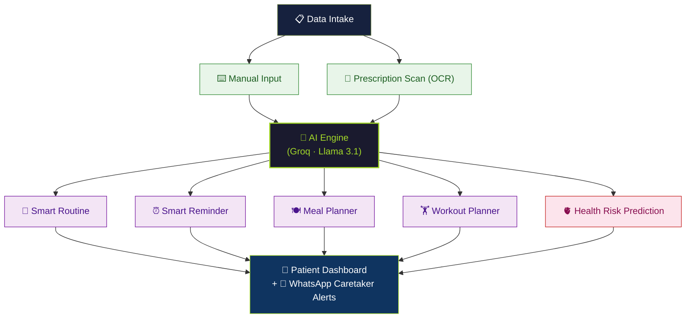

<div align="center">


# 🌿 AyuSync

### *Your Ultimate AI-Powered Health & Medicine Companion*

[](https://fastapi.tiangolo.com/)
[](https://react.dev/)
[](https://vitejs.dev/)
[](https://groq.com/)
[](https://www.python.org/)
[](https://www.typescriptlang.org/)
[](https://opensource.org/licenses/MIT)

<br/>

> **AyuSync** is a full-stack, AI-driven health management platform that transforms complex medication routines into intelligent, personalized care — combining prescription scanning, smart reminders, AI-generated health plans, and an immersive 3D organ drug visualizer, all in one place.

</div>

---

## 📋 Table of Contents

- [🎯 Project Overview](#-project-overview)
- [🏗️ Proposed Solution Architecture](#%EF%B8%8F-proposed-solution-architecture)
- [✨ Features](#-features)
- [🛠️ Tech Stack](#%EF%B8%8F-tech-stack)
- [📁 Project Structure](#-project-structure)
- [⚙️ Installation & Setup](#%EF%B8%8F-installation--setup)
- [🔌 API Reference](#-api-reference)
- [🤖 AI Capabilities](#-ai-capabilities)
- [🌐 Application Pages](#-application-pages)
- [🚀 Environment Variables](#-environment-variables)
- [🛡️ License](#%EF%B8%8F-license)

---

## 🎯 Project Overview

**AyuSync** is an intelligent, centralized health management solution that streamlines the intake of medical data — via manual entry or automated prescription scanning — into a central AI processing core. This AI engine translates the user's medical data into a suite of fully personalized, automated outputs designed to holistically support patient care.

By dynamically generating **Smart Routines**, intelligent medication **Reminders**, customized **Meal and Workout Plans** tailored to the user's health profile, and a powerful **Health Risk Prediction** system with 3D organ visualization, AyuSync proactively guides users and their caretakers through their daily wellness journey.

---

## 🏗️ Proposed Solution Architecture

The core philosophy of AyuSync: **simplify inputs, maximize intelligent outputs.**



### 🔄 Flow Explained

| Stage | Component | Description |
|-------|-----------|-------------|
| **Input** | Manual Entry | User manually logs medication name, dosage, frequency, and category |
| **Input** | Prescription Scan | OCR-powered image upload extracts medications from printed/handwritten prescriptions |
| **Core** | Groq AI Engine | Llama 3.1 (8b instant) processes medical data for intelligent, personalized recommendations |
| **Output** | Smart Routine | A fully structured daily schedule built around your medication timings |
| **Output** | Smart Reminders | Automated notifications + WhatsApp alerts for missed doses (caretaker notified) |
| **Output** | Meal Planner | AI-curated diet recommendations that complement active medications |
| **Output** | Workout Planner | Safe, personalized exercise plans based on medication interactions |
| **Output** | Health Risk Prediction | Real-time pharmacological predictions + interactive 3D organ impact visualization |

---

## ✨ Features

### 🧬 AI-Powered 3D Drug Visualizer
- Select any active medicine — the **Groq LLM instantly analyzes** its pharmacology
- 3D anatomical models rendered in WebGL (Skeletal, Vascular, Visceral, Nervous systems)
- **Green highlights** = drug target organs | **Red highlights** = side-effect risk organs
- AI auto-switches to the most relevant anatomical system for each drug
- Displays reasoning, mechanism summary, and confidence level per medicine
- All results cached per session to minimize API calls

### 💊 Smart Medicine Management
- Full CRUD for tracking medicines with name, dosage, frequency, and category
- Dose-tracking with daily status (Taken / Pending / Missed)
- Historical adherence analytics per medicine

### 📸 Prescription OCR Scanner
- Upload any prescription image (printed or handwritten)
- AI automatically extracts and digitizes medicine details directly into your profile

### 📅 Smart Routine Builder
- Auto-generates structured daily routines around your medication schedule
- Time-block visualization for AM, PM, and evening doses

### ⏰ Intelligent Reminders & WhatsApp Alerts
- Background APScheduler jobs check adherence automatically
- If a dose is missed, a **WhatsApp message is sent via Twilio** to both patient and registered caretaker
- Configurable caretaker phone number per user profile

### 🥗 AI Meal Planner
- Generates meal plans that **complement**, **avoid contraindications**, and **reinforce** the effects of your current medicines
- Accounts for dietary restrictions based on medication class (e.g., blood thinners → low-vitamin-K advice)

### 🏃 AI Workout Planner
- Generates personalized exercise routines validated against medication interactions
- Avoids recommending high-intensity workouts for patients on cardiac or bone medications

### 🩺 Health Risk Predictor
- Predicts **long-term risks** based on medicine combination using clinical pharmacovigilance AI
- Recommends **preventive checkups and lab tests** (e.g., LFT every 6 months for long-term meds)
- Structured food, exercise, and yoga precautions
- One-tap **WhatsApp Health Report sharing** with caretaker

### 💧 Water Intake Tracker
- Log and track daily water intake against a personalized goal

### 📊 Reports & Analytics
- Weekly/monthly adherence trends
- Medicine-by-medicine compliance breakdown
- Exportable data summaries

---

## 🛠️ Tech Stack

### Frontend
| Technology | Purpose |
|-----------|---------|
| **React 18** | Component-based UI framework |
| **Vite 5** | Ultra-fast dev server and build tool |
| **TypeScript** | Type safety across the entire codebase |
| **Tailwind CSS** | Utility-first styling system |
| **Framer Motion** | Fluid micro-animations and page transitions |
| **React Three Fiber** | Declarative 3D scene management |
| **@react-three/drei** | 3D model loaders, controls, and helpers |
| **Three.js** | WebGL-powered 3D rendering engine |
| **React Router DOM** | Client-side routing |
| **React Query** | Server state and cache management |
| **Lucide React** | Consistent icon library |

### Backend
| Technology | Purpose |
|-----------|---------|
| **FastAPI** | High-performance async Python API framework |
| **SQLAlchemy** | ORM for database modeling and queries |
| **SQLite** | Lightweight, file-based relational database |
| **Pydantic** | Request/response schema validation |
| **APScheduler** | Background CRON job scheduling |
| **Groq API** | Llama 3.1 LLM inference (ultra-low latency) |
| **Twilio** | WhatsApp messaging for alerts and reports |
| **httpx** | Async HTTP client for Groq API calls |
| **Pillow / pytesseract** | Prescription OCR scanning pipeline |
| **python-jose** | JWT authentication tokens |
| **bcrypt** | Secure password hashing |

---

## 📁 Project Structure

```
AyuSync/
├── 📁 backend/
│   ├── 📁 app/
│   │   ├── 📁 routers/          # All API endpoint handlers
│   │   │   ├── users.py         # Auth (register, login, OTP verify)
│   │   │   ├── medicines.py     # Medicine CRUD + dose tracking
│   │   │   ├── routine.py       # Daily schedule management
│   │   │   ├── meals.py         # AI meal plan generation
│   │   │   ├── exercises.py     # AI workout plan generation
│   │   │   ├── health_risk.py   # AI health risk + 3D organ impact
│   │   │   ├── reports.py       # Analytics and reporting
│   │   │   ├── dashboard.py     # Dashboard summary stats
│   │   │   ├── water.py         # Water intake tracking
│   │   │   ├── prescription.py  # OCR prescription scanning
│   │   │   └── ai_tips.py       # Contextual AI tips
│   │   ├── 📁 services/         # Business logic and AI services
│   │   │   ├── groq_client.py   # Async Groq HTTP client
│   │   │   ├── health_risk.py   # Health risk + organ impact AI
│   │   │   ├── ai_generator.py  # Meal & exercise generation
│   │   │   ├── ai_tips.py       # Tips generation
│   │   │   ├── scheduler.py     # Background reminder scheduler
│   │   │   ├── prescription_ocr.py  # OCR + AI extraction pipeline
│   │   │   └── whatsapp.py      # Twilio WhatsApp integration
│   │   ├── models.py            # SQLAlchemy database models
│   │   ├── schemas.py           # Pydantic request/response schemas
│   │   ├── auth.py              # JWT authentication utilities
│   │   ├── config.py            # Settings and env var management
│   │   ├── database.py          # DB engine and session setup
│   │   └── main.py              # FastAPI app entry point
│   ├── .env                     # Environment variables (never commit!)
│   └── requirements.txt
│
├── 📁 frontend/
│   ├── 📁 src/
│   │   ├── 📁 pages/
│   │   │   ├── AuthPage.tsx     # Login / Register / OTP verification
│   │   │   ├── Index.tsx        # Main dashboard
│   │   │   ├── Medicines.tsx    # Medicine management
│   │   │   ├── Routine.tsx      # Daily routine viewer
│   │   │   ├── Meals.tsx        # Meal planner
│   │   │   ├── Exercises.tsx    # Workout planner
│   │   │   ├── HealthRisk.tsx   # AI health risk predictor
│   │   │   ├── HealthRisk3D.tsx # 3D drug organ visualizer
│   │   │   ├── Reports.tsx      # Analytics reports
│   │   │   └── Settings.tsx     # User profile & settings
│   │   ├── 📁 components/
│   │   │   ├── OrganVisualizer.tsx  # 3D WebGL anatomy component
│   │   │   ├── AppSidebar.tsx       # Navigation sidebar
│   │   │   ├── TopNavbar.tsx        # Top navigation bar
│   │   │   ├── BottomNav.tsx        # Mobile bottom navigation
│   │   │   └── 📁 ui/              # shadcn/ui component library
│   │   ├── 📁 services/         # API service layer
│   │   ├── 📁 hooks/            # Custom React hooks
│   │   ├── 📁 context/          # Auth and Language context
│   │   └── 📁 lib/              # Utility functions and API client
│   ├── 📁 public/
│   │   ├── logo.png
│   │   ├── skeleton.glb         # 3D skeletal system model
│   │   ├── vascular_system.glb  # 3D vascular system model
│   │   ├── visceral_system.glb  # 3D visceral organs model
│   │   └── nervous_system.glb   # 3D nervous system model
│   └── vite.config.ts
│
├── 📁 docs/
│   └── 📁 assets/               # Architecture diagrams & screenshots
│
└── README.md
```

---

## ⚙️ Installation & Setup

### Prerequisites
- Python **3.11+**
- Node.js **18+**
- A [Groq API Key](https://console.groq.com/) (free tier available)
- *(Optional)* A [Twilio Account](https://www.twilio.com/) for WhatsApp alerts

### 1. Clone the Repository
```bash
git clone https://github.com/your-username/ayusync.git
cd AyuSync
```

### 2. Backend Setup
```bash
cd backend

# Create and activate virtual environment
python -m venv .venv

# Windows
.venv\Scripts\activate
# macOS / Linux
source .venv/bin/activate

# Install dependencies
pip install -r requirements.txt
```

**Create `.env`** in the `backend/` directory:
```env
SECRET_KEY=your_super_secret_key_here
ALGORITHM=HS256
ACCESS_TOKEN_EXPIRE_MINUTES=10080

DATABASE_URL=sqlite:///./healthai.db

# Groq — add up to 5 keys for automatic failover
GROQ_API_KEY_1=gsk_your_key_here
GROQ_API_KEY_2=
GROQ_API_KEY_3=
GROQ_API_KEY_4=
GROQ_API_KEY_5=

# Twilio WhatsApp (optional — enables caretaker alerts)
TWILIO_ACCOUNT_SID=AC_your_sid
TWILIO_AUTH_TOKEN=your_auth_token
TWILIO_WHATSAPP_FROM=whatsapp:+14155238886
```

```bash
# Start the FastAPI dev server
uvicorn app.main:app --reload --port 8000
```
> 📍 API running at `http://localhost:8000` · Interactive docs at `http://localhost:8000/docs`

### 3. Frontend Setup
```bash
# Open a new terminal
cd frontend
npm install
npm run dev
```
> 📍 App running at `http://localhost:8080`

---

## 🔌 API Reference

| Method | Endpoint | Description |
|--------|----------|-------------|
| `POST` | `/api/auth/register` | Create a new user account |
| `POST` | `/api/auth/login` | Login with email + password |
| `POST` | `/api/auth/send-otp` | Send WhatsApp OTP |
| `POST` | `/api/auth/verify-otp` | Verify OTP and complete login |
| `GET` | `/api/medicines` | List all active medicines |
| `POST` | `/api/medicines` | Add a new medicine |
| `PATCH` | `/api/medicines/{id}` | Update medicine details |
| `DELETE`| `/api/medicines/{id}` | Remove a medicine |
| `POST` | `/api/medicines/{id}/dose/{dose_id}/take` | Mark a dose as taken |
| `GET` | `/api/routine/today` | Fetch today's medicine schedule |
| `GET` | `/api/meals/generate` | Generate AI meal plan |
| `GET` | `/api/exercises/generate` | Generate AI workout plan |
| `GET` | `/api/health-risk` | Run full AI health risk report |
| `POST` | `/api/health-risk/organ-impact` | AI 3D organ impact for one medicine |
| `POST` | `/api/health-risk/share-whatsapp` | Share health report via WhatsApp |
| `POST` | `/api/prescription/scan` | Scan prescription image via OCR |
| `GET` | `/api/dashboard` | Fetch dashboard summary stats |
| `GET` | `/api/reports` | Fetch adherence report data |
| `POST` | `/api/water/log` | Log water intake |
| `GET` | `/api/ai-tips` | Get contextual AI health tips |

> Full interactive documentation available at `http://localhost:8000/docs` once the backend is running.

---

## 🤖 AI Capabilities

AyuSync integrates **Groq API** using the `llama-3.1-8b-instant` model for ultra-low latency LLM inference. All AI modules are modular and independently callable:

| AI Module | Description | Output |
|-----------|-------------|--------|
| **Health Risk Predictor** | Analyzes medicine combinations for long-term risks | Risk list with severity (low/medium/high) |
| **Organ Impact Analyzer** | Maps a single medicine to target & risk organs | `targetOrgans`, `riskOrgans`, `recommendedSystem` |
| **Precaution Advisor** | Generates food, exercise, and yoga precautions | Structured food/exercise/yoga lists |
| **Checkup Recommender** | Suggests preventive medical tests | Test list with urgency and frequency |
| **Meal Generator** | Creates personalized, medicine-aware meal plans | Daily meal plan with nutritional rationale |
| **Exercise Generator** | Builds safe workout plans | Structured routines with benefits |
| **AI Tips** | Generates daily contextual health advice | Context-aware health tip strings |
| **Prescription OCR** | Extracts medicines from prescription images | Structured medicine list |

> **Resilience:** All Groq calls include automatic key rotation across up to 5 configured API keys, with graceful fallback to sensible rule-based defaults if all keys fail.

---

## 🌐 Application Pages

| Page | Route | Description |
|------|-------|-------------|
| **Auth** | `/auth` | Login, Register, OTP Verification |
| **Dashboard** | `/` | Overview stats, upcoming doses, water tracker |
| **Medicines** | `/medicines` | Full medicine management with dose tracking |
| **Routine** | `/routine` | Daily time-blocked medication schedule |
| **Meal Plan** | `/meals` | AI-generated personalized meal planner |
| **Exercises** | `/exercises` | AI-generated workout and yoga planner |
| **Reports** | `/reports` | Historical adherence charts and analytics |
| **AI Risk Predictor** | `/health-risk` | Full pharmacovigilance health risk report |
| **3D Visualizer** | `/health-risk/3d` | Interactive 3D drug-organ impact viewer |
| **Settings** | `/settings` | User profile, caretaker config, appearance |

---

## 🚀 Environment Variables

| Variable | Required | Description |
|----------|----------|-------------|
| `SECRET_KEY` | ✅ | JWT signing secret key |
| `DATABASE_URL` | ✅ | SQLite or PostgreSQL connection string |
| `GROQ_API_KEY_1` | ✅ | Primary Groq API key |
| `GROQ_API_KEY_2–5` | ⬜ | Fallback Groq API keys (for rate limit resilience) |
| `TWILIO_ACCOUNT_SID` | ⬜ | Twilio Account SID (WhatsApp features) |
| `TWILIO_AUTH_TOKEN` | ⬜ | Twilio Auth Token |
| `TWILIO_WHATSAPP_FROM` | ⬜ | Twilio WhatsApp sender number |

---

## 🛡️ License

This project is licensed under the **MIT License** — feel free to use, modify, and distribute.

---

<div align="center">

**Built with ❤️ to empower smarter, digital-first healthcare.**

*AyuSync — Sync your health, sync your life.*

</div>
